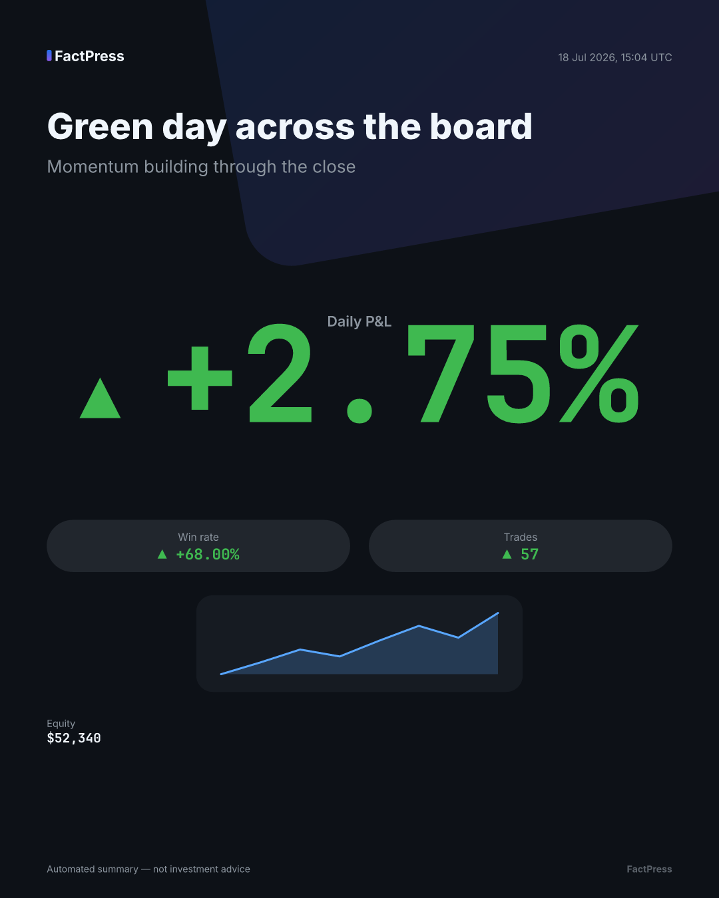
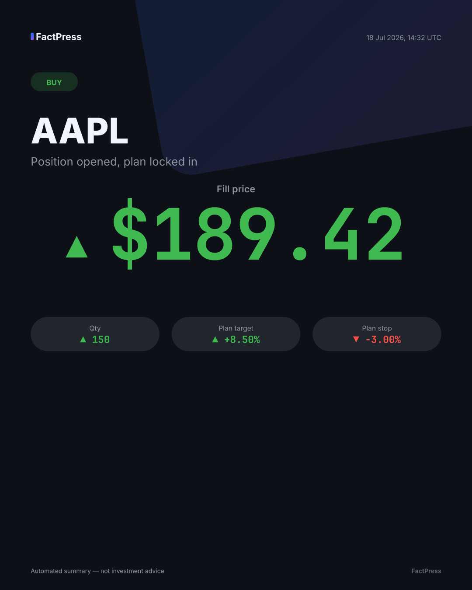
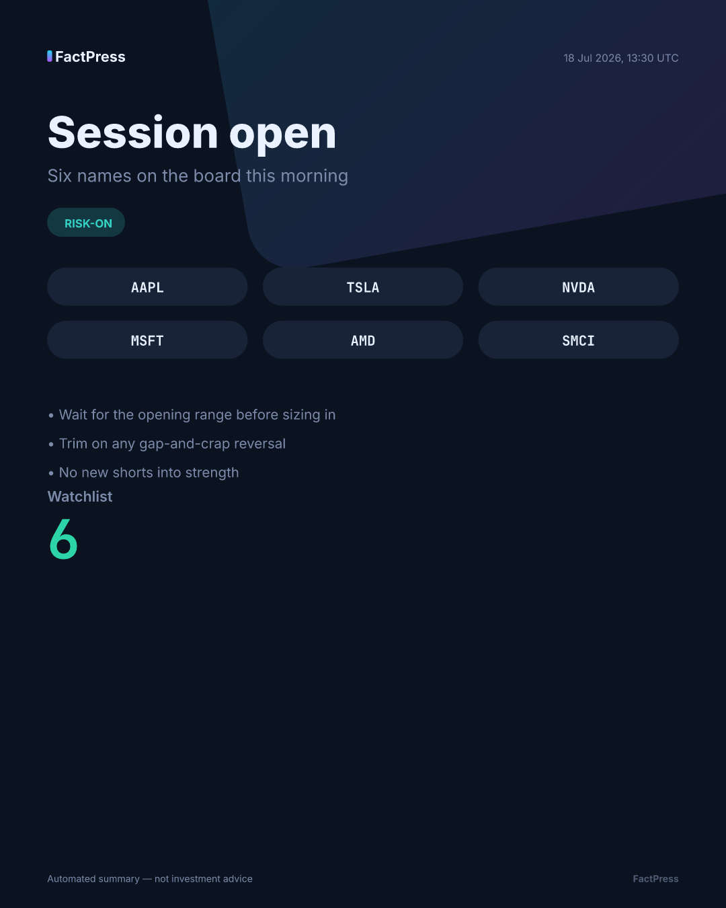
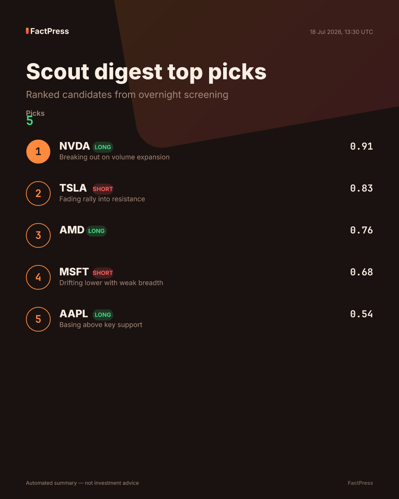
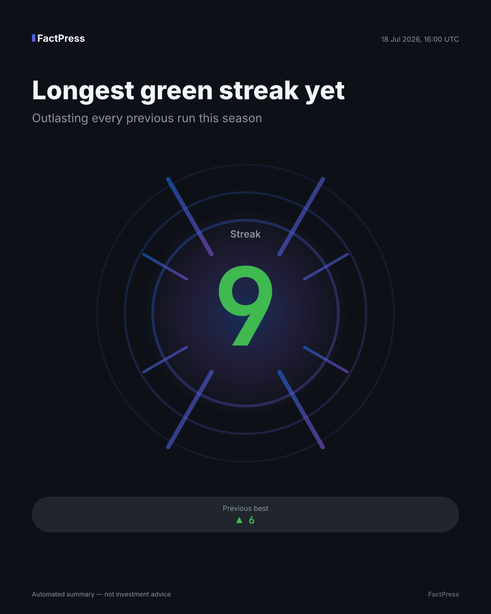
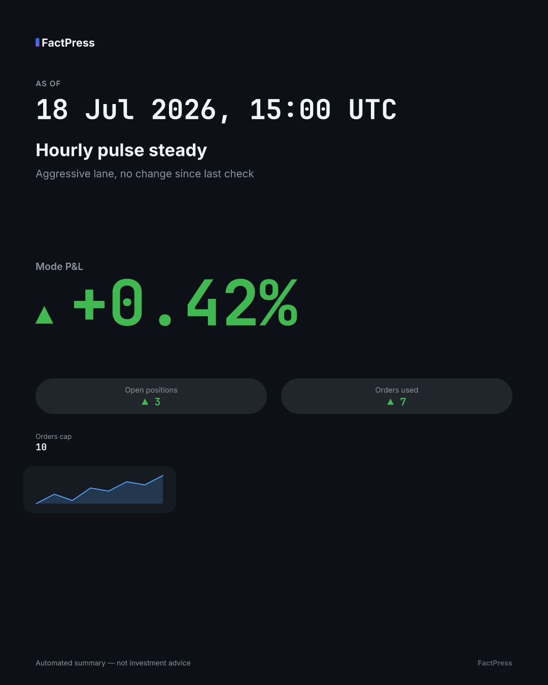
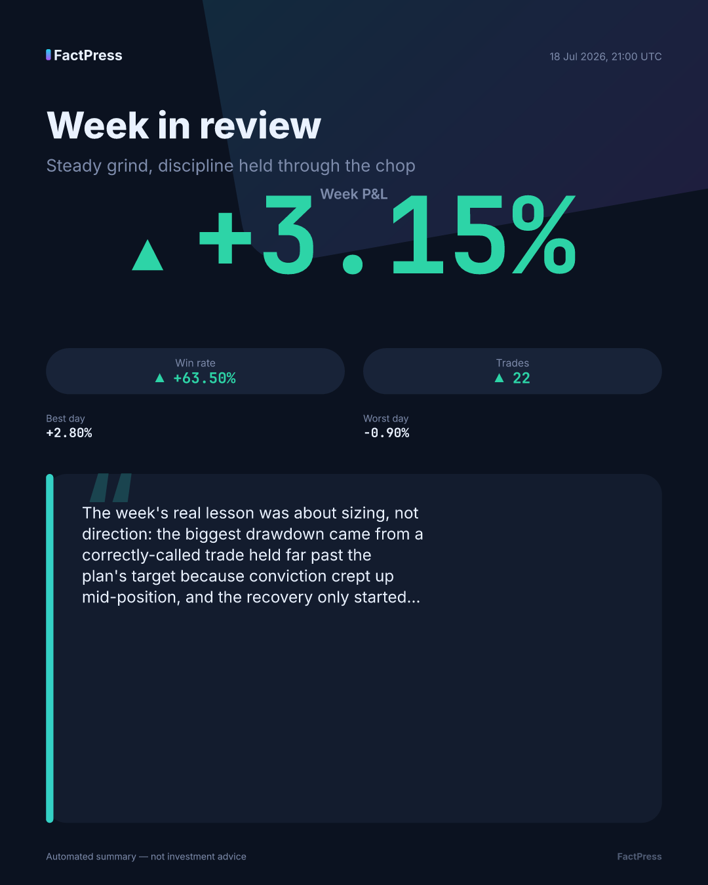

# FactPress

**Facts in, identical prints out — the LLM is the editor, never the printer.**

[](https://github.com/avijitsez/FactPress/actions/workflows/ci.yml)


FactPress turns structured fact payloads into deterministically rendered,
LLM-art-directed infographic notifications. A creative-director LLM chooses
template, tone, headline copy, palette, and emphasis — strictly validated
against a schema with **no free numeric fields** — while a Jinja2 + SVG
renderer resolves every numeral, currency symbol, and sparkline directly from
the facts payload. Same facts + same design spec always produce a
byte-identical PNG, so notifications never depend on an LLM having a good day.

No trading logic lives here — FactPress doesn't know what a stock is. Give it
a JSON payload of facts and it gives you back a card. What you put in the
facts is entirely yours.

## Gallery

All seven built-in templates, rendered from the fixtures in
`tests/golden/fixtures/` at feed size (1080×1350):

| Template | Preview |
|---|---|
| `daily_pnl` |  |
| `trade_executed` (`buy_opened`) |  |
| `session_digest` (`session_open`) |  |
| `digest_top_picks` |  |
| `milestone` |  |
| `pulse_update` |  |
| `reflection_recap` |  |

## How it works

```
[ANY SYSTEM]                [FACTPRESS]
 produces facts   ──JSON──►  1. FACT VALIDATION (Pydantic schema per event type)
 (your trading               2. CREATIVE DIRECTOR (LLM)
  system, or                    in : facts + template catalog + brand kit + tone
  anyone's app)                 out: DesignSpec JSON — template choice, headline,
                                     emphasis keys, palette pick, layout variant,
                                     caption. STRICTLY validated. Retried once,
                                     then falls back to deterministic default copy.
                             3. RENDERER (deterministic, zero LLM)
                                Jinja2 SVG template + facts + spec → PNG
                                ALL numbers formatted by the renderer
                                directly from the facts payload
                             4. PUBLISHER → Telegram sendPhoto
                                (chat_id + message_thread_id aware)
```

The director is the *only* nondeterministic stage, and it is quarantined
behind a validated schema with a deterministic fallback — a bad LLM day
degrades the headline, never the numbers, and never blocks a notification.

## The guardrail: numbers-by-reference

The `DesignSpec` the LLM produces has **no free numeric fields**. It
references metrics *by key* — "feature `daily_pnl_pct` as the hero stat" —
and the renderer resolves that key against the facts payload with its own
precision and currency formatting. As the design doc puts it:

> "A hallucinated number is structurally impossible — worst case is a badly
> chosen headline, never a wrong figure."

This is enforced two ways, not just by convention:

- **Numbers-by-reference.** `hero_metric_key`, `emphasis_keys`, and
  `callout_keys` are the only way a spec points at a number. There is no
  field in `DesignSpec` the LLM can put a numeral's *value* into.
- **Hard Unicode digit ban.** Every LLM-authored copy field — `headline`,
  `subhead`, `caption`, `emoji` — is validated at the schema level to reject
  any character in a Unicode numeral category (`Nd`/`Nl`/`No`): not just
  ASCII `0`–`9`, but circled digits (`⑨`), Roman numerals (`Ⅲ`), fractions,
  and superscripts too. A numeral-shaped hallucination cannot reach rendered
  copy through any of them.
- **Tone constraints.** Tone (celebratory / neutral / cautionary) is an enum,
  auto-constrained by the facts — a red day cannot render as celebratory.
- **Insights-by-reference.** `reflection_recap` is the one archetype whose
  content is prose. The prose itself is never LLM-authored: it arrives in
  the facts payload as candidate text from the host system, and the spec
  selects one *by index* and may trim it to the slot cap. The director picks
  and trims; it never writes the insight.

## Quickstart

Not yet on PyPI — install straight from the git repo for now:

```bash
pip install "factpress @ git+https://github.com/avijitsez/FactPress.git"
```

Once published, this will be:

```bash
pip install factpress
```

### CLI: zero-LLM render

No LLM endpoint needed — the CLI renders straight from a deterministic
fallback `DesignSpec`, so you can see a card in one command:

```bash
factpress render examples/daily_pnl.json --out daily_pnl.png --preview
```

### Python: the facade

```python
from factpress import FactPress

ff = FactPress(
    llm_base_url="http://localhost:8100/v1",   # any OpenAI-compatible endpoint
    llm_model="whatever-your-relay-serves",
    telegram_token=...,
    default_chat_id=...,
    brandkit="brandkits/default.yaml",
    template_paths=["./templates_private"],    # searched before built-ins —
)                                               # host-specific templates
                                                # without forking

# Render only (PNG bytes, no publish):
png = ff.render(facts={"event_type": "daily_pnl", ...}, event_type="daily_pnl")

# Render + publish to Telegram:
ff.publish(
    facts={"event_type": "trade_executed", ...},
    event_type="trade_executed",
    chat_id=...,
    thread_id=...,   # topic-aware
)
```

`FactPress()` with no `llm_base_url` is a fully valid, common configuration:
`render`/`publish` use the deterministic fallback spec directly, no LLM
round-trip at all.

## Determinism

- Golden-image tests (`tests/golden/`) hash every fixture × size combination
  and assert byte-identical PNGs on every run.
- Fonts are vendored (`factpress/assets/fonts/`) and rendering runs with
  `skip_system_fonts=True` — no dependency on what's installed on the host.
- The `resvg-py` rasterizer version is pinned in `pyproject.toml`.
- Hashes are stored **per platform** (`tests/golden/hashes.json`, keyed by
  `sys.platform`) since font shaping and rasterizer minor-version behavior
  can legitimately differ across OSes — a platform with no stored hashes
  yet skips rather than fails, and CI populates its own entries.

## Bring your own templates

`template_paths` is searched *before* the built-ins, so a private template
directory can override a built-in template id (or add new ones) without
forking:

```python
ff = FactPress(template_paths=["./templates_private"])
```

See [docs/template-authoring.md](docs/template-authoring.md) for the
manifest schema, the render-context contract, and the golden-test workflow
for adding a new template.

## Roadmap

- **v0.2 — interactive approval cards.** A published card becomes a decision
  surface: inline buttons, authorized-tap handling, and a two-stage visual
  acknowledgement (decision, then execution) rendered back onto the same
  card. Not implemented yet — the current release is one-way notifications
  only.

## Docs

- [docs/rendering-contract.md](docs/rendering-contract.md) — the render
  context contract templates are built against.
- [docs/template-authoring.md](docs/template-authoring.md) — writing a new
  template, manifest schema, golden-test workflow.
- [CONTRIBUTING.md](CONTRIBUTING.md) — dev setup, tests, lint, determinism
  rules for contributors.

## License

Apache-2.0. See [LICENSE](LICENSE).
